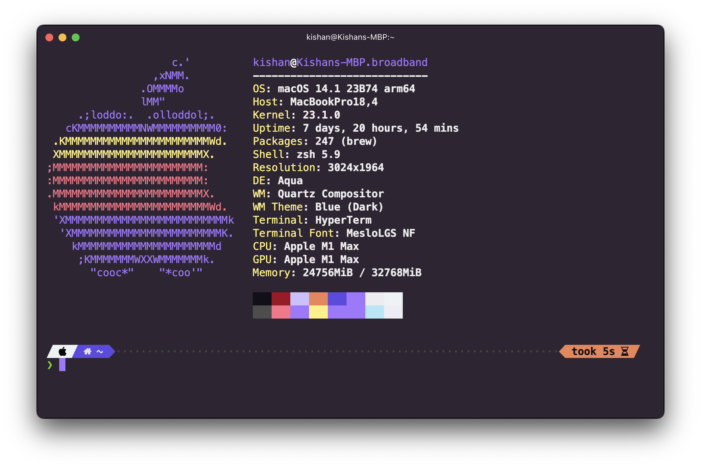

## hyper-cool-theme

<p align="center">
✨ A beautiful dark theme for Hyper terminal.
  <br><br>

  <!-- npm version -->
  <a href="https://www.npmjs.com/package/hyper-cool-theme">
    
  </a>

  <!-- downloads -->
  <a href="https://www.npmjs.com/package/hyper-cool-theme">
    
  </a>
</p>

<p align="center">
  
</p>

# Requirements

- [Hyper terminal](https://hyper.is)

# Installation

```bash
hyper i hyper-cool-theme
```

# License
[MIT © Kishan Jadav](./LICENSE)
